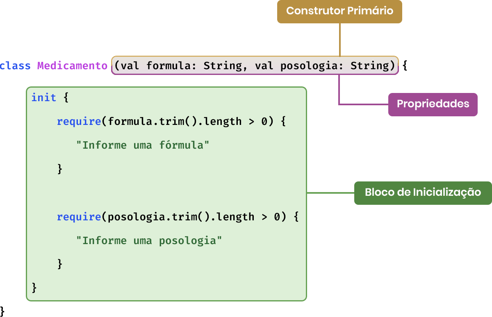

# Classe
>Uma classe é um bloco de construção de software fundamental, encontrado na grande maioria das linguagens orientadas a obketos e, dessa forma, também presente em kotlin. Elas são usadas para criar novos tipos de dados, utilizando uma estrutura composta por métodos e variáveis que podem  possuir os seus próprios tipos.



## Declaração de classes
>Em kotlin, um arquivo pode conter diferentes declarações de classes, as quais são feitas utilizando a palavra reservada 'class'. Abaixo está uma declaração de uma class no kotlin da forma mais simples possível.

`class Medicamento`

>No exemplo como a classe Medicamento não possui um corpo, podemos omitir as chaves que estariam na frente do seu nome.


## Construtores
>Um construtor pe uma função especial da classe, utilizada na criação e inicialização dos objetos derivados dela. Kotlin distingue os construtores de uma classe entre primários e secundários. O construtor primário de uma classe faz parte do seu cabeçalho e pode conter apenas uma lista de parâmetros, assim como apresentado abaixo.

`class Medicamento(val formula: String, val posologia: String)`

>Dado que o construtor primário não pode conter nenhum código, uma classe pode conter uma ou mais blocos de inicialização, que são excutados na ordem como são declarados no corpo da mesma. Nesses blocos de inicialização, conforme visto, podemos acessar quaisquer parâmetros que estejam presentes no contrutor primário.

```kotlin
class Medicamento(val formula: String, val posologia: String) {
     init {
         require(formula.trim().length > 0) {
            "Informe uma fórmula"
         }

         require(posologia.trim().length > 0) {
            "Informe uma posologia"
         }
     }
}
```

>Além do construtor primário, uma classe também pode declarar um ou mais construtores secundários. Esses, por sua vez, sempre devem utilizar a palvra reservada 'constructor' em suas declarações, mesmo quando um modificador de acesso for omitido ou nenhuma anotação for utilizada. Exemplo:

```kotlin
class Medicamento{
    constructor(formula: String, posologia: String)
}
```

>No caso de uma classe possuir mais de um construtor, sendo um deles primário, cada construtor secundário deve delegar ao construtor primário. Quando ambos os construtores estiverem na mesma classe, a delegação de um construtor para o outro é feita com a palavra reservada 'this'.


>Podemos utilizar valores padrão do construtor delegado de uma classe. Para demonstrar isso vamos adicionar um terceiro parâmetro no construtor para a contraindeicação do medicamento. Considerando que a  classe Medicamento possa ser inicializada sem um valor para essa propriedade, caso no qual o mesmo passará a ser uma mensagem padrão, poderíamos modelá-la da seguinte forma.

```kotlin
class Medicamento(val formula: String, posologia: String, val contraindicacao: String) {

     constructor(formula: String, posologia: String): this(formula, posologia,
          "Este medicamento não é indicado para pessoas alérgicas a $formula")
}
```

>Dessa forma, na declarção do construtor `this(formula, posologia, "Este medicamento não é indicado para pessoas alérgicas a $formula")` informamos um valor padrão para a propriedade 'contraindicacao' e assim a classe poderá ser instanciada com ou sem esse terceiro parâmetro. Exemplo:

```kotlin
val medicamento1 = Medicamento("C8H9NO2", "...")
val medicamento2 = Medicamento("C8H9NO2", "...", "Minha contraindicação")
```

>No exemplo, o objeto 'medicamento1' será iniciado com o valor padrão para a propriedade 'contraindicacao', que é "Este medicamento não é indicado para pessoas alérgicas a $formula". Para o objeto 'medicamento2', o valor da propriedade 'contraindicacao' será aquele informado no construtor, que é "Minha contraindicação".

## Construtores e propriedades
>O construtor primário age de forma diferente do construtor secundário quando a geração de propriedades para a classe na qual eles são declarados. Essa abordagem impede que as propriedades de uma classe variem de acordo com os parâmetros declarados nos construtores, uma vez que a  geração de propriedades é limitada ao construtor primário de uma classe. Exemplo:


```kotlin
class Medicamento {
    constructor(formula: String, posologia: String)
}
```

>Diferente do construtor primário, os parâmetros do construtor secundário não gerarão propriedades, visto que ao tentar executar um código como o proximo exemplo, será gerado um erro de compilação.

```kotlin
val medicamento: Medicamento = Medicamento("", "")
medicamento.formula

//Error:(10, 17) Kotlin: Unresolved reference: formula
```

>Sendo assim, nesse caso é obrigatório declarar uma propriedade na classe Medicamento, a qual poderá receber o valor do parâmetro do construtor e ser acessada a partir de uma instância, como visto acima. Podemos eliminar o erro ao acessar a propriedade 'formula', conforme o exemplo.

```kotlin
class Medicamento {
     val formula: String

     constructor(formula: String, posologia: String) {
        this.formula = formula
     }
}
```

>Assim, uma classe em kotlin pode possuir propriedades declaradas em seu corpo explicitamente. Essas propriedades podem ser mutáveis, quando declaradas coma palavra reservada 'var', ou somente leitura, quando declaradas com a palavra reservada 'val'. Caso elas sejam declaradas imutáveis, será necessário inicializá-las, o que pode ser feito no construtor secundário da classe, como no exemplo acima.


## Imutabilidade dos parâmetros dos construtores secundários
>